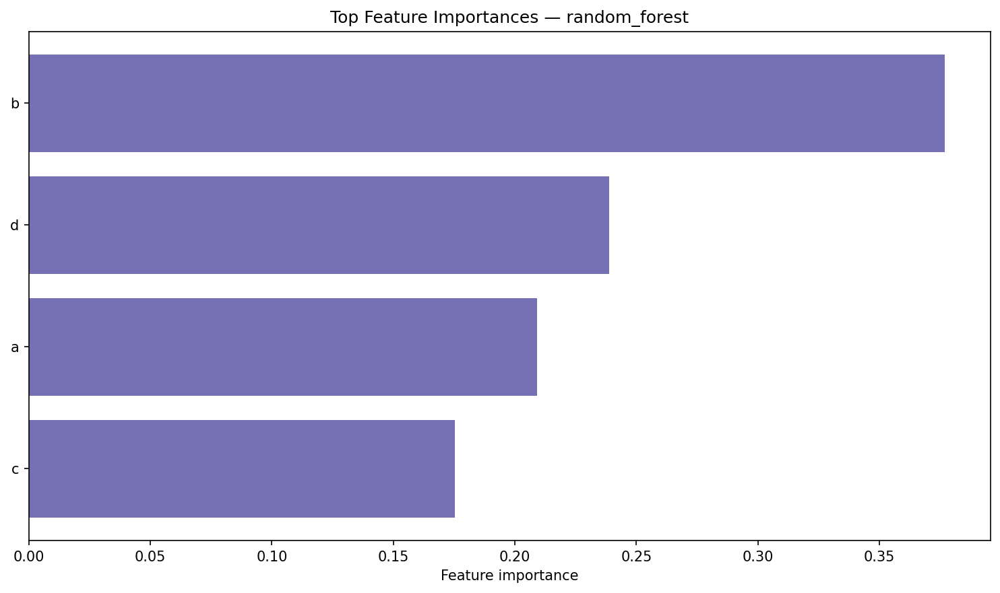

# Fraud Detection Analytics — Final Report

**Project:** fraud-detection-analytics  
**Challenge:** End-to-end fraud detection on e-commerce transaction data  
**Date:** June 2026

---

## 1. Executive Summary

This project delivers a reproducible machine learning pipeline for detecting fraudulent e-commerce transactions. Using **Fraud_Data** (151,112 transactions, 9.36% fraud rate), we built a path from raw logs to a tuned classifier, SHAP explainability, executive insights, and an interactive Streamlit dashboard.

The tuned **random_forest_tuned** model is the best performer on the stratified holdout set, selected by **PR-AUC (0.625)**. It achieves **99.1% precision** and **52.7% recall**, catching **1,492** fraud cases while generating only **13** false alarms across **30,223** holdout transactions.

The dominant risk signal is **short time between signup and purchase** (`time_since_signup_hours`), accounting for approximately **69%** of Random Forest feature importance and ranking first in SHAP analysis. The model is suitable for a **review-first** deployment: alerts are highly trustworthy, but roughly half of fraud still evades detection at the default threshold.

**Key deliverables:** modular Python package, 70 automated tests, processed feature matrix (203 features), model comparison artifacts, SHAP plots, executive recommendations, and a six-page Streamlit dashboard.

---

## 2. Business Understanding

Online merchants face a dual challenge: fraudulent orders cause direct revenue loss and chargebacks, while aggressive automated blocking creates false declines and poor customer experience.

**Business objective:** Prioritize suspicious transactions for human review with high precision, preserving analyst capacity while capturing as much fraud as operationally feasible.

**Success criteria for this challenge:**

| Criterion | Rationale |
|-----------|-----------|
| High precision | Minimize false alarms that overwhelm fraud analysts |
| Acceptable recall | Capture enough fraud to justify model deployment |
| Explainability | Analysts and compliance teams must understand *why* a case was flagged |
| Reproducibility | Pipelines, splits, and reports must be auditable |

**Deployment posture:** A precision near 99% supports routing flagged orders to a manual review queue rather than auto-declining without oversight. Recall near 53% indicates room for improvement through threshold tuning and complementary verification rules (e.g., new-account purchase cooldowns).

---

## 3. Dataset Overview

### Fraud_Data.csv (primary modeling dataset)

| Attribute | Value |
|-----------|-------|
| Rows | 151,112 |
| Columns | 11 |
| Target | `class` (0 = legitimate, 1 = fraud) |
| Fraud rate | 9.36% (14,151 fraud / 136,961 legitimate) |
| Imbalance ratio | ~9.7:1 |
| Missing values | None |
| Duplicate rows | None |
| Users per row | One transaction per `user_id` |

**Key fields:** `signup_time`, `purchase_time`, `purchase_value`, `device_id`, `source`, `browser`, `sex`, `age`, `ip_address`.

### creditcard.csv (secondary dataset — preprocessed only)

| Attribute | Value |
|-----------|-------|
| Raw rows | 284,807 |
| Clean rows | 283,726 (after removing 1,081 duplicates) |
| Fraud rate | 0.17% (473 fraud / 283,253 legitimate) |
| Imbalance ratio | ~599:1 |
| Features | PCA components (`V1`–`V28`), `Time`, `Amount` |

Fraud accounts for only 0.17% of credit-card transactions (~599:1 imbalance). Median fraudulent `amount` is €9.82 vs €22.00 for legitimate rows. This dataset was preprocessed but not modeled in the current challenge scope.

### IpAddress_to_Country.csv (geolocation reference)

| Attribute | Value |
|-----------|-------|
| Rows | 138,846 |
| Purpose | IPv4 range-to-country lookup for Fraud_Data enrichment |


*Figure 1: Class distribution in Fraud_Data. Fraud is the minority class but materially present at ~9.4%.*

---

## 4. Data Cleaning and Preprocessing

Preprocessing is implemented in `src/preprocessing/` and executed via `scripts/run_preprocess.py`.

**Fraud_Data pipeline**

1. Standardize column names to lowercase snake_case
2. Parse `signup_time` and `purchase_time` as datetimes
3. Validate required columns; no missing values or duplicates found in raw data
4. Coerce numeric and string dtypes for downstream engineering

**creditcard.csv pipeline**

1. Standardize column names
2. Remove **1,081 duplicate rows**
3. Cast `class`, `amount`, `time`, and PCA features to numeric types

All cleaning steps are covered by unit tests (`tests/test_cleaning.py`, `tests/test_datasets.py`). Processed outputs are saved to `data/processed/`.

---

## 5. Exploratory Data Analysis

EDA was conducted in `notebooks/eda-fraud-data.ipynb`. Accuracy is a poor sole metric given ~9.4% fraud prevalence; precision, recall, F1, and PR-AUC are more appropriate.

### Strongest behavioral signal: signup-to-purchase timing

| Class | Median signup-to-purchase time |
|-------|-------------------------------|
| Legitimate (0) | ~1,443 hours (~60 days) |
| Fraud (1) | ~0 hours |

Fraudsters purchase almost immediately after account creation. In the engineered dataset, the median is **0.0003 hours** for fraud vs **1,443 hours** for legitimate users.


*Figure 2: Signup-to-purchase time by class (95th percentile clip for readability).*

### Channel and demographic patterns

| Segment | Fraud rate |
|---------|------------|
| Direct traffic | 10.54% |
| Ads | 9.21% |
| SEO | 8.93% |
| Chrome | 9.88% |
| Firefox | 9.52% |
| Safari | 9.02% |
| Male | 9.55% |
| Female | 9.10% |

Median `purchase_value` (~35) and median `age` (~33) are similar across classes — amount and age alone do not separate fraud well.

### creditcard.csv summary

| Metric | Legitimate (0) | Fraud (1) |
|--------|------------------|-----------|
| Share of rows | 99.83% | 0.17% |
| Median `amount` | €22.00 | €9.82 |
| Median `time` (seconds) | 84,711 | 73,408 |

---

## 6. Geolocation Enrichment

IP addresses in Fraud_Data are enriched via range-based lookup (`src/preprocessing/geolocation.py`, `scripts/run_geolocation_enrichment.py`):

1. Convert IPs to 32-bit integers (`ip_address_int`)
2. Match against `IpAddress_to_Country.csv` using `pd.merge_asof`
3. Validate each IP falls within the matched range upper bound
4. Assign `country`, or `"unknown"` when no range matches

| Metric | Value |
|--------|-------|
| Transactions enriched | 151,112 |
| IPs matched to a country | 129,146 (**85.46%**) |
| Unmatched (`unknown`) | 21,966 |
| Distinct countries | 182 |

Among countries with at least 100 transactions, higher observed fraud rates included Ecuador (26.4%), Tunisia (26.3%), and Peru (26.1%). These segment patterns support including `country` as a categorical feature, with caution for small-sample geographies.

Output: `data/processed/fraud_data_geolocated.csv`

---

## 7. Feature Engineering

Feature engineering (`src/features/`, `scripts/run_feature_engineering.py`) produces two artifacts:

| File | Shape |
|------|-------|
| `fraud_data_engineered.csv` | 151,112 rows × 22 columns |
| `fraud_data_features.csv` | 151,112 rows × 204 columns (203 features + `class`) |

### Temporal features

| Feature | Description |
|---------|-------------|
| `time_since_signup_hours` | Hours between signup and purchase |
| `hour_of_day` | Purchase hour (0–23) |
| `day_of_week` | Purchase weekday (0 = Monday) |

### Velocity features

Rolling transaction counts (`txn_count_last_1h`, `txn_count_last_24h`, `txn_count_last_168h`), `hours_since_last_txn`, `user_cumulative_txn_count`, and `user_txn_velocity_per_day` are computed for repeat-purchase scenarios. Because each `user_id` has only one transaction in this dataset, velocity features are uniformly **1** (or **0** hours since last transaction) and carry little discriminative signal.

### Encoding and scaling

- Numeric features standardized with `StandardScaler`
- Categorical features (`source`, `browser`, `sex`, `country`) one-hot encoded
- High-cardinality `device_id` excluded from one-hot encoding to avoid sparse, unstable columns

---

## 8. Class Imbalance Handling

Fraud detection models trained on raw proportions favor the majority class. We apply **SMOTE to the training split only** (`src/modeling/imbalance.py`, `scripts/run_imbalance_resampling.py`).

**Safeguards**

1. Stratified 80/20 train/test split (`RANDOM_STATE=42`, `TEST_SIZE=0.2`) before resampling
2. SMOTE applied only to `(X_train, y_train)`
3. Test set never resampled — holdout reflects natural fraud prevalence

| Stage | Class 0 | Class 1 | Fraud % |
|-------|---------|---------|---------|
| Train (before SMOTE) | 109,568 | 11,321 | 9.36% |
| Train (after SMOTE) | 109,568 | 109,568 | 50.0% |
| Test (holdout) | 27,393 | 2,830 | 9.36% |

**Split sizes:** 120,889 training rows before resampling → 219,136 after SMOTE → 30,223 test rows (unchanged).


*Figure 3: Class distribution before and after SMOTE on the training split.*

---

## 9. Modeling Approach

Modeling targets `data/processed/fraud_data_features.csv` using `src/modeling/workflow.py`.

**Split and resampling:** Stratified holdout preserves ~9.4% fraud prevalence; SMOTE balances training data to 50/50.

**Algorithms evaluated (saved holdout comparison):**

| Model | Tuning |
|-------|--------|
| Logistic Regression | `GridSearchCV` on `C` |
| Random Forest | `RandomizedSearchCV` on tree depth, estimators, leaf size |

The codebase also supports XGBoost tuning (`RandomizedSearchCV`); the saved comparison artifacts in `reports/modeling/` and `reports/outputs/` reflect the **logistic regression** and **random_forest_tuned** runs.

**Cross-validation:** 3-fold CV on the pre-SMOTE training split, scored on **PR-AUC** (`average_precision`). Final models refit on SMOTE-balanced training data.

**Selection metric:** PR-AUC on the untouched holdout set — appropriate for imbalanced fraud detection where ranking positive cases matters more than overall accuracy.

**Evaluation metrics:** Precision, recall, F1, ROC-AUC, PR-AUC, and confusion matrix counts.

Entry points: `python scripts/run_modeling_reports.py`, `notebooks/modeling.ipynb`

---

## 10. Model Comparison

Holdout evaluation on **30,223** transactions:

| Model | Precision | Recall | F1 | ROC-AUC | PR-AUC |
|-------|-----------|--------|-----|---------|--------|
| **random_forest_tuned** | **0.9914** | **0.5272** | **0.6884** | **0.7696** | **0.6246** |
| logistic_regression | 0.1691 | 0.6912 | 0.2718 | 0.7423 | 0.3864 |

**Best model:** `random_forest_tuned` (PR-AUC gap vs runner-up: **+0.2382**)

### Confusion matrix — random_forest_tuned

| | Predicted Legitimate | Predicted Fraud |
|--|---------------------|-----------------|
| **Actual Legitimate** | 27,380 (TN) | 13 (FP) |
| **Actual Fraud** | 1,338 (FN) | 1,492 (TP) |

Logistic regression achieves higher recall (0.6912) but at the cost of precision (0.1691) and **9,608** false positives — impractical for analyst review queues. Random Forest tuned delivers the better precision-recall trade-off for a review-first workflow.


*Figure 4: Precision-recall curve comparison on the holdout set.*


*Figure 5: Confusion matrix for random_forest_tuned.*



*Figure 6: Top-10 feature importance for the best model.*

---

## 11. SHAP Explainability

SHAP analysis (`scripts/run_shap_analysis.py`) explains the best tree-based model on the holdout set.

**Model explained:** `random_forest` · Holdout PR-AUC: **0.6243** · Holdout F1: **0.6887**

SHAP shows which features pushed a transaction toward or away from a fraud alert. It does not prove causation but helps analysts understand scoring drivers.

### Top 10 predictors by mean |SHAP|

| Rank | Feature | Mean \|SHAP\| | Impact direction |
|------|---------|---------------|------------------|
| 1 | `time_since_signup_hours` | 0.1182 | decreases_fraud_risk |
| 2 | `country_United States` | 0.0207 | decreases_fraud_risk |
| 3 | `browser_Chrome` | 0.0091 | decreases_fraud_risk |
| 4 | `day_of_week` | 0.0082 | decreases_fraud_risk |
| 5 | `source_Direct` | 0.0072 | decreases_fraud_risk |
| 6 | `hour_of_day` | 0.0061 | decreases_fraud_risk |
| 7 | `country_Germany` | 0.0045 | decreases_fraud_risk |
| 8 | `country_unknown` | 0.0034 | decreases_fraud_risk |
| 9 | `age` | 0.0030 | decreases_fraud_risk |
| 10 | `purchase_value` | 0.0029 | decreases_fraud_risk |

*Note: For `time_since_signup_hours`, higher values (longer time since signup) decrease the fraud score; lower values (immediate purchases) increase it — consistent with EDA.*

The waterfall chart uses holdout row **23286** to show how individual features raised or lowered the fraud score for one transaction.


*Figure 7: SHAP beeswarm summary — feature impact on model output.*


*Figure 8: Mean |SHAP| values for top predictors.*


*Figure 9: Single-case waterfall (holdout row 23286).*


*Figure 10: SHAP dependence plot for the top feature.*

---

## 12. Key Fraud Insights

1. **Signup velocity dominates.** `time_since_signup_hours` accounts for ~69% of Random Forest importance. Fraudsters buy within hours of signup; legitimate customers wait weeks.

2. **High precision, moderate recall.** At 99.1% precision and 52.7% recall, the model reliably flags real fraud but misses ~47% at the default threshold.

3. **Low analyst noise.** Only 13 false positives on 30,223 holdout transactions — flagged cases are strong review candidates.

4. **Geography and channel add context.** Four geographic features rank in the top 10; Direct traffic has the highest channel fraud rate (10.54%) in EDA. These signals should inform triage, not blanket blocking.

5. **Velocity features are uninformative** in the current dataset (one transaction per user). Revisit when repeat-purchase data is available.

6. **Amount and age are weak alone.** Median purchase value and age are similar across classes; they contribute in combination with timing and geography.

---

## 13. Recommendations

### Fraud prevention

- Apply stepped purchase limits or extra verification when `time_since_signup_hours` is below a business threshold (e.g., 24–72 hours).
- Combine signup timing with purchase value and channel in a lightweight rules layer ahead of the ML model.
- Monitor Direct-traffic conversion funnels (10.54% fraud rate vs 8.93%–9.21% for other channels).

### Customer verification

- Step-up verification (email, phone, 3-D Secure) for high-score new users with very short signup-to-purchase times.
- Route transactions with unmapped IP/country (`country_unknown`, 21,966 rows) to verification rather than auto-approval.

### Operational monitoring

- Track recall and false negatives weekly; tune thresholds on the PR curve if missed fraud is too costly.
- Monitor feature drift for `time_since_signup_hours`, country mix, and channel distribution.
- Re-run tuning and SHAP quarterly or after major fraud incidents.

### Responsible use

- Use geographic and channel signals for **review queues**, not discriminatory blocking.
- Document decisions and audit flagged cases regularly.

Full stakeholder brief: `reports/fraud_insights.md` · Interactive dashboard: `streamlit run dashboard/app.py`

---

## 14. Limitations

1. **Single-transaction users** — Velocity features do not vary; the dataset cannot test repeat-purchase fraud patterns.
2. **IP geolocation coverage** — 14.5% of IPs unmatched (`unknown`), limiting geographic signal for those rows.
3. **Recall gap** — ~47% of holdout fraud missed at default threshold; business cost of missed fraud not quantified in this challenge.
4. **creditcard.csv not modeled** — Preprocessed only; extreme imbalance (~599:1) requires a separate modeling pass.
5. **SHAP scope** — Explanations reflect historical patterns; new fraud tactics may not appear until retraining.
6. **Geographic segments** — High fraud rates in small countries may reflect sample size, not inherent risk.

---

## 15. Future Work

1. **Threshold tuning** — Optimize decision thresholds on the PR curve for business-specific precision/recall targets.
2. **creditcard.csv modeling** — Extend pipeline to the highly imbalanced credit-card dataset.
3. **Resampling comparison** — Benchmark SMOTE against class weights, ADASYN, and undersampling.
4. **XGBoost holdout evaluation** — Include tuned XGBoost in the saved comparison artifacts alongside RF and logistic regression.
5. **Production deployment** — API scoring service, model monitoring, and case-management integration.
6. **Repeat-purchase velocity** — Re-engineer velocity features when multi-transaction user data is available.

---

## 16. Conclusion

This challenge produced an end-to-end fraud analytics pipeline: clean data, geolocation enrichment, engineered features, SMOTE-based imbalance handling, tuned Random Forest classification, SHAP explainability, executive insights, and a Streamlit dashboard — all backed by 70 automated tests and reproducible CLI scripts.

The tuned Random Forest achieves **PR-AUC 0.625** with **99.1% precision** on Fraud_Data, making it a credible candidate for **review-first** deployment. The single strongest finding — immediate post-signup purchases — is actionable through policy even without model inference.

The primary gap is recall (~53%). Closing it through threshold tuning, verification workflows, and eventual creditcard.csv modeling are the highest-value next steps before production rollout.

---

## Appendix: Reproducibility

```bash
pip install -r requirements.txt
pytest tests/ -v

python scripts/run_preprocess.py
python scripts/run_geolocation_enrichment.py
python scripts/run_feature_engineering.py
python scripts/run_imbalance_resampling.py
python scripts/run_modeling_reports.py
python scripts/run_shap_analysis.py
python scripts/run_fraud_insights.py
streamlit run dashboard/app.py
```

**Configuration:** `RANDOM_STATE=42`, `TEST_SIZE=0.2` in `src/config.py`

**Key artifacts**

| Artifact | Location |
|----------|----------|
| Model metrics | `reports/modeling/model_comparison_metrics.csv` |
| Best model summary | `reports/modeling/best_model_summary.csv` |
| Feature importance | `reports/modeling/top_features_best_model.csv` |
| SHAP summary | `reports/shap/shap_top_features.csv` |
| Executive insights | `reports/fraud_insights.md` |
| EDA notebook | `notebooks/eda-fraud-data.ipynb` |
| Modeling notebook | `notebooks/modeling.ipynb` |

*Export to PDF: open `docs/final-report.html` in a browser and print to PDF, or run `python scripts/build_final_report_html.py` to regenerate the HTML.*
